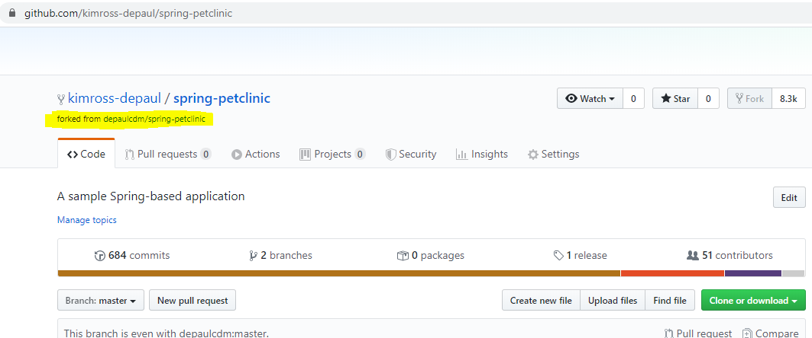
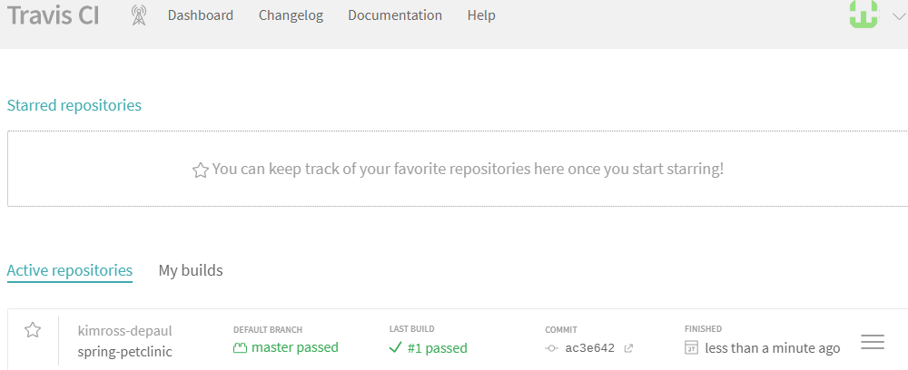
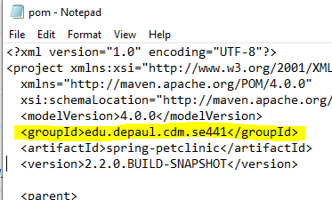
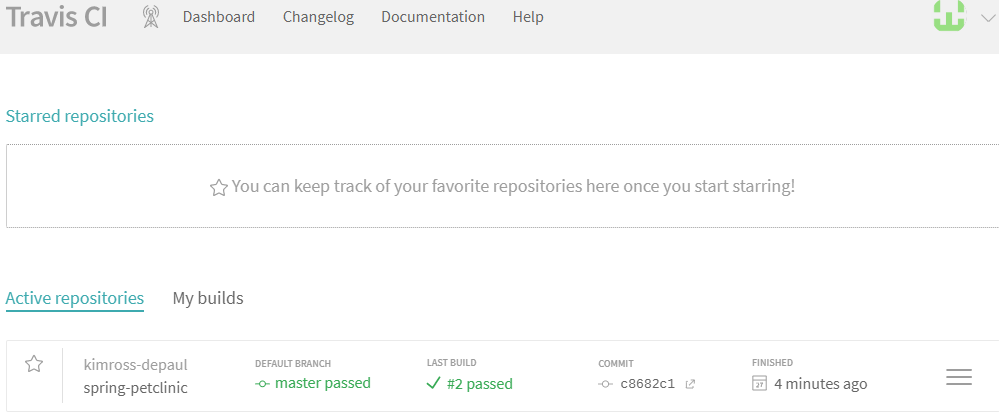
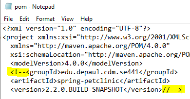
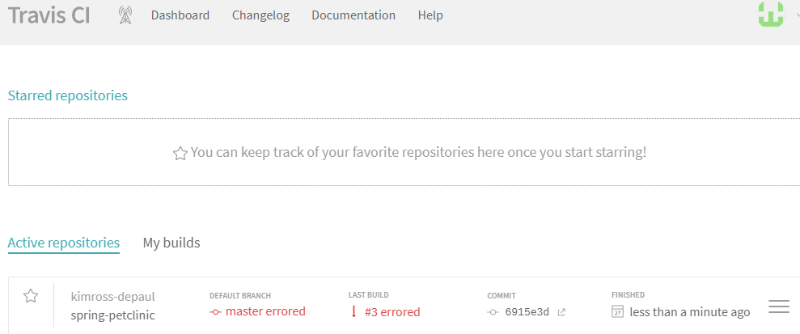
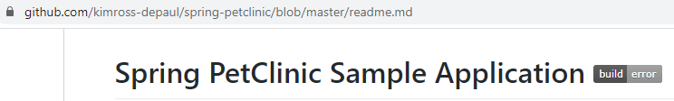
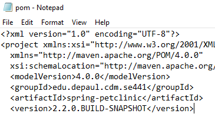
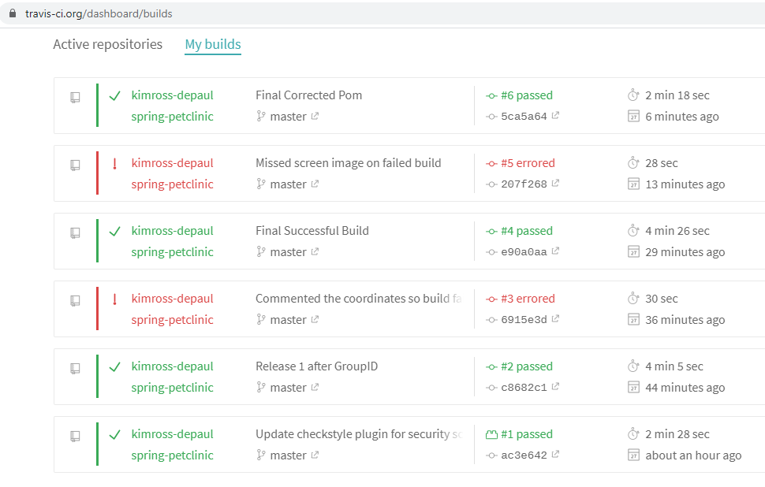
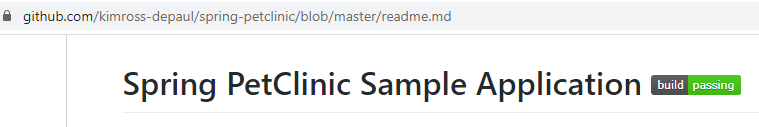

# Homework #5 Submission Details
## Kim Ross SE441 On-line Section
---
### 1.  Github account showing forked repository   
   

### 2.  Travis CI dashboard with successful first build   
    

### 3.  POM file changed coordinates

### 4.  Travis CI dashboard with successful 2nd build (after changing the group id)   
   

### 5.  POM file with coordinates commented out   
   

### 6.  Travis CI dashboard with failed build   
   

### 7.  Github repository showing the failed build status    
   

### 8.  The corrected POM file    
   

### 9.  Travis CI dashboard after POM file correction   
(NOTE:  I repeated the failed build a second time to re-capture a screen image of that step)   
   

### 10.  Github readme.md file showing the build success   
   
